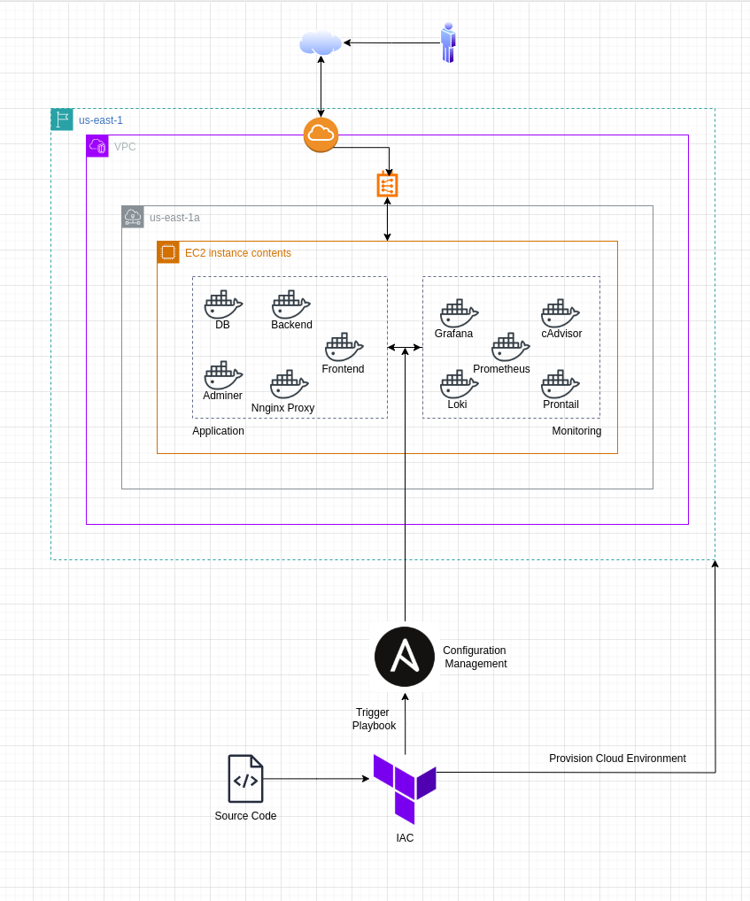

## Automate Deployment with Terraform and Ansible

### **Project Overview**

This task automates the deployment of a full-stack application and monitoring infrastructure using **Terraform** and **Ansible**. The goal is to create an efficient and automated process for provisioning cloud infrastructure, deploying Dockerized applications, and setting up monitoring and logging solutions—all using Infrastructure as Code (IaC) and Configuration Management (CM) tools.

---

### **Table of Contents**
1. [Introduction](#introduction)
2. [Pre-requisites](#pre-requisites)
3. [Architecture Overview](#architecture-overview)
4. [Steps to Set Up and Deploy](#steps-to-set-up-and-deploy)
   1. [Step 1: Prebuild Docker Images](#step-1-prebuild-docker-images)
   2. [Step 2: Design the Architecture](#step-2-design-the-architecture)
   3. [Step 3: Configure Terraform](#step-3-configure-terraform)
   4. [Step 4: Configure Ansible](#step-4-configure-ansible)
5. [Testing the Deployment](#testing-the-deployment)
6. [Troubleshooting](#troubleshooting)

---

### **Introduction**

This project is designed to automate the deployment of a **full-stack application** and its associated **monitoring infrastructure** using: **Terraform** for infrastructure provisioning and **Ansible** for configuration management and application deployment.

Key components:
- **Terraform**: Infrastructure provisioning (VM, networking, etc.)
- **Ansible**: Application deployment and configuration automation
- **Docker**: Containerization of frontend, backend, and monitoring services
- **Prometheus and Grafana**: For monitoring and visualizing the application metrics and logs

### **Pre-requisites**

Before you start with the setup, make sure you have the following installed:

- **Terraform**: [Install Terraform](https://www.terraform.io/downloads.html)
- **Ansible**: [Install Ansible](https://docs.ansible.com/ansible/latest/installation_guide/index.html)
- **Docker**: [Install Docker](https://docs.docker.com/get-docker/)
- **AWS CLI** (Optional, if using AWS): [Install AWS CLI](https://docs.aws.amazon.com/cli/latest/userguide/cli-configure-quickstart.html)

Additionally:
- A Docker Hub account for pushing your prebuilt Docker images.
- Cloud credentials (AWS, GCP, etc.) for provisioning infrastructure.

### **Architecture Overview**

#### **Architecture Diagram**



The deployment architecture consists of two primary components: **Application Stack** and **Monitoring Stack**.

1. **Application Stack**:
   - **Frontend**: React application in Docker
   - **Backend**: FastAPI service in Docker
   - **Database**: PostgreSQL (running in a Docker container)
   - **Reverse Proxy**: Nginx for routing requests between services

2. **Monitoring Stack**:
   - **Prometheus** for collecting metrics
   - **Grafana** for visualizing metrics and logs
   - **cAdvisor** for monitoring container-level metrics
   - **Loki** and **Promtail** for logs aggregation

### **Steps to Set Up and Deploy**

#### **Step 1: Prebuild Docker Images**

To containerize the application, we need to prebuild Docker images for the **Frontend** (React) and **Backend** (FastAPI) components. These images will be pushed to Docker Hub for easy deployment across environments.

1. **Frontend Docker Image**:
   - **Build** the frontend React application using Docker:
   ```bash
   docker login -u <your-username> -p <password>
   git clone https://github.com/GideonIsBuilding/cv-challenge-o2.git && cd cv-challenge-o2
   docker build -t <your-username>/frontend:latest ./frontend
   docker push <your-username>/frontend:latest
   ```

2. **Backend Docker Image**:
   - Similarly, **build** and **push** the backend FastAPI service to Docker Hub:
   ```bash
   docker build -t <your-username>/backend:latest ./backend
   docker push <your-username>/backend:latest
   ```

#### **Step 2: Design the Architecture**

In this step, you'll define the architecture of the cloud infrastructure, ensuring it includes:
- The required cloud resources (e.g., EC2 instances, networks, security groups).
- The **shared Docker networks** for communication between containers.
- **Routing configurations** (using Nginx).

#### **Step 3: Configure Terraform**

1. **Set up Terraform Configuration**: 
   - In the `terraform/` directory, you’ll find `main.tf` for provisioning the infrastructure. 
   - Configure variables such as cloud provider, instance type, and region, depending on where your infrastructure will be deployed.
   - Example: Set the AWS region and instance type in `variables.tf`.

2. **Generate Inventory File**: 
   - Terraform will dynamically generate the `inventory` file used by Ansible for connecting to the remote server based on the jinja file `inventory.tpl`. Use this format:
   ```
   [app]
   54.90.144.248 ansible_user=ubuntu ansible_ssh_private_key_file=/home/gideon/Downloads/nginix.pem ansible_ssh_common_args='-o StrictHostKeyChecking=no'
   ```
Replace the IP with your elastic IP address and the private key with appropriate file path on your local machine.

#### **Step 4: Configure Ansible**

1. **Inventory File**:
   - The `inventory` file is generated by Terraform. It contains the IP addresses and SSH credentials required to access your provisioned servers.

2. **Ansible Roles**:
   - Ansible roles are used to automate the configuration of the server and the deployment of the application and monitoring stacks.
   - In `ansible/playbook.yml`, there are roles:
     - Common: Updates and upgrade packages, installs docker, logs into the docker hub, and copies the needed enviroment variable for the frotend and backend services.
     - App: Deploys the frontend, backend, Adminer, Nginx Proxy Manager, and PostgreSQL using Docker Compose.
     - Monitoring: Set up Prometheus and Grafana for monitoring.

**Why Ansible roles?**
- Ansible roles modularize tasks and make the playbook reusable and scalable. This modularity ensures that each part of the configuration is reusable in future projects or environments.

---

### **Deployment Process**

To deploy the application stack and monitoring infrastructure:
1. **Run Terraform**:
   ```bash
   cd terraform
   terraform init   # Initialize the configuration
   terraform plan   # Apply the configuration and provision resources
   terraform apply -auto-approve
   ```
   This will provision the cloud infrastructure and trigger the Ansible playbook to configure the server and deploy all required services.

2. **Ansible Playbook Execution**:
   Ansible will automatically:
   - Set up the environment (install Docker, etc.).
   - Deploy the application stack (frontend, backend, database).
   - Set up the monitoring stack (Prometheus, Grafana, cAdvisor, Loki).

---

### **Troubleshooting**

1. **Connection Issues**:
   - Make sure that SSH ports are open in the security group for EC2 instances.
   - Ensure Terraform has provisioned the resources successfully.

2. **Ansible Playbook Failures**:
   - Check Ansible logs for any errors in playbook execution.
   - Confirm Docker is installed and functional.

3. **Monitoring Issues**:
   - Ensure that Prometheus is scraping metrics correctly and that Grafana is configured to pull data from Prometheus.

---

### **Contributing**

Feel free to fork the repository and submit pull requests with improvements, bug fixes, or new features.

---